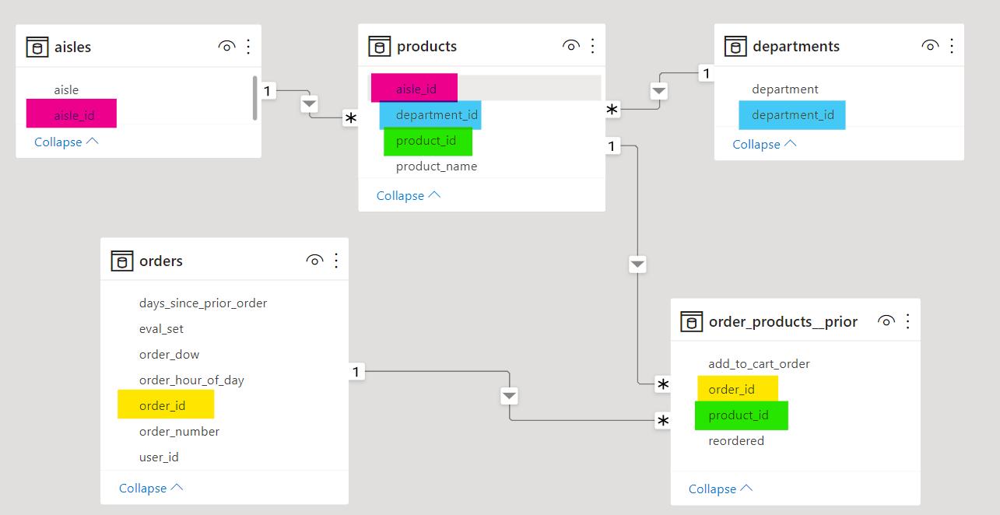

# Data Engineering Project
This project aims to serve as a demonstration of the skills and knowledge associated with a data engineer.  
It was led by Paul Liu and took two months to complete with the assistance of Teammates Terry Zhang and Zijian Ye. It consists of the following section:
- Data Sourcing  
- Data Architecture  
- Data Engineering  
- Model Establishment  
- Model Deployment  

The establishment of the data architecture is a great indicator of the understanding towards relational database and conceptual schema. A series of AWS cloud services are applied in this project to reflect our understanding towards data pipeline, CI/CD, modelling and collaboration within a data science team.

# Background
This 
Whether you shop from meticulously planned grocery lists or let whimsy guide your grazing, our unique food rituals define who we are. Instacart, a grocery ordering and delivery app, aims to make it easy to fill your refrigerator and pantry with your personal favorites and staples when you need them. After selecting products through the Instacart app, personal shoppers review your order and do the in-store shopping and delivery for you.  
Instacart’s data science team plays a big part in providing this delightful shopping experience. Currently they use transactional data to develop models that predict which products a user will buy again, try for the first time, or add to their cart next during a session. Recently, Instacart open sourced this data - see their blog post on 3 Million Instacart Orders, Open Sourced.

# Data Sourcing
the Entity-Relational Model is constructed and drawn below to illustrate the database schema of the transactional data collected.

It is evident that there are some one-to-many relationships betweem 5 tables that are connecting by unique primary keys and foreign keys.
By constructing such a schema, it will be much easier when we query specific fields later on.
# Data Architecture 

# Data Engineering
## ETL pipeline

# Data Science Modelling

# Model Deployment

# Future Work

